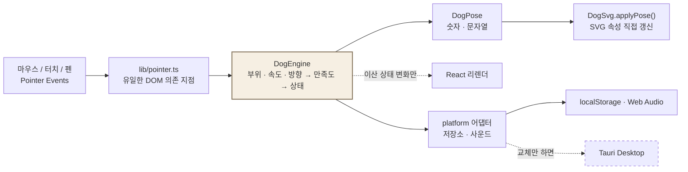

# 쓰담하개 (PuPat) 🐕

> **웹에서 강아지를 직접 쓰다듬는 인터랙티브 서비스.**
> 키울 수는 없어도, 쓰다듬을 수는 있으니까.

강아지를 누른 채 움직이면 **부위 · 속도 · 방향**을 실시간으로 판정해, 품종마다 다르게 반응합니다.
서버도 로그인도 없이 링크만 열면 바로 만질 수 있습니다.

**🔗 [pupat.vercel.app](https://pupat.vercel.app/)** — 모바일에서 "홈 화면에 추가"하면 PWA로 설치됩니다

<!--   ← 쓰다듬기 → bliss 전환 GIF 삽입 위치 -->

| | |
|---|---|
| **제작 기간** | 2026.08.26 ~ 08.28 (3일) |
| **참여 인원** | 개인 프로젝트 1인 — 기획 · 인터랙션 설계 · 개발 · 배포 |

---

## ✨ 주요 기능
- **마우스 트래킹**
  
  

  마우스를 따라 강아지의 시선과 고개가 움직입니다
- **쓰다듬기**

   

  누름 + 이동 거리 + 속도 + 털의 결 방향을 매 샘플 측정. 손을 떼면 값이 서서히 감쇠해 반응이 툭 끊기지 않습니다.

  만족도: `부위 호감도 × 속도 궁합 × 털 방향`의 곱. 음수면 싫어하고(`annoyed`), 높은 값을 유지하면 `petting → happy → bliss`로 녹아내립니다.
- **볼 스쿼시**

  

  키프레임 재생이 아닌 손끝 위치가 곧 변형이 되는 **스프링 물리 모델**적용. 누를 땐 단단하게 따라오고, 떼면 한 번 튕겼다 돌아옵니다.
- **쓰담 기록** — 오늘/이번 주/연속 방문(`/record`). localStorage에만 저장하고 서버로 보내지 않습니다.

  


---

## 🏗 구조



```
src/
├── core/       브라우저 API를 쓰지 않는 순수 로직 (엔진 · 품종 · 상태 · 기록)
├── platform/   교체 지점 — StorageAdapter · SoundAdapter
├── hooks/      React ↔ core 연결
├── lib/        pointer.ts — 유일한 DOM 의존 지점
└── app/        / · /record
```

두 가지 규칙으로 정리했습니다.
1. **입력 종류는 경계에서 사라진다** — 마우스인지 터치인지는 `lib/pointer.ts`를 지나면 없어지고, 코어는 숫자만 받습니다.
2. **연속 값은 리렌더하지 않는다** — 고개·꼬리·호흡은 `requestAnimationFrame`에서 SVG에 직접 반영하고, 리렌더는 행동이 바뀔 때만 일어납니다.

---

## 🧰 기술 스택 (선택 이유)

| 기술 | 선정 이유 |
|---|---|
| **Next.js 15 · React 19 · TypeScript** | 서버가 필요 없는 프로젝트지만 `output: 'export'`로 **정적 번들을 뽑을 수 있어** 향후 데스크톱용 앱을 위한 Tauri에 그대로 적용 가능. 엔진이 React 밖에 있어 `useSyncExternalStore`로 구독 |
| **인라인 SVG** (Canvas·이미지 아님) | 귀·눈·꼬리·볼을 **부위 단위로 조작**해야 했습니다. 파츠마다 ref를 잡아 속성만 바꿀 수 있고, 해상도 독립적이며 스크린 리더 텍스트를 넣기 가능 |
| **Pointer Events** | mouse/touch를 각각 다루면 코드가 두 벌이 됩니다. `setPointerCapture`로 손이 강아지 밖으로 나가도 쓰다듬기가 끊기지 않음 |
| **Tailwind CSS v4** | 시안의 색을 `oklch` 토큰으로 한 번만 정의해 재사용하기 위함 |
| **Web Audio API** | 짧은 반응음만 필요하므로 별도 오디오 파일 다운로드 불필요. 합성음이라 **번들 추가 용량 0**. |
| **localStorage** | 쓰담 기록은 서버에 보낼 이유가 없는 개인 데이터기에 로컬에 저장 |
| **PWA 직접 구성** (manifest + sw.js 수기) | 플러그인은 빌드 파이프라인에 묶여 정적 내보내기와 충돌할 여지가 있었습니다. 직접 쓰면 캐시 전략을 정확히 알 수 있고, **지워도 앱은 그대로 동작** |
| **Vercel** | 서버가 없어 정적 배포로 충분, 배포 편의성을 위해 선택 |


---

## 🔧 트러블슈팅

### 데스크톱에서만 링크·버튼이 눌리지 않던 문제
- **문제** — 배포 후 데스크톱에서 기록 링크·품종 변경·사운드 토글이 전혀 작동하지 않음. **모바일은 정상.**
- **원인** — 쓰다듬기가 끊기지 않도록 무대 전체에 `setPointerCapture`를 걸어 뒀는데, 헤더·푸터의 링크도 같은 무대 안이라 그 위에서 눌러도 캡처가 걸렸습니다. 그 결과 이어지는 `click`이 원래 타깃이 아닌 **캡처한 무대로 전달**됐습니다. 모바일은 터치의 `click`이 터치 대상에서 생성되어 증상이 드러나지 않았습니다.
- **해결** — `onPointerDown`에서 타깃이 `a, button, input, ...`에 속하면 캡처하지 않고 그대로 통과
- **배운 점** — 포인터 캡처는 이후 `click`의 전달 경로까지 바꿉니다. "한쪽에서만 재현된다"는 비대칭이 원인을 가장 빨리 좁혀 줬습니다.

### 60fps 인터랙션과 React 리렌더의 충돌
- **문제** — 고개·꼬리·볼 변형을 상태로 두니 매 프레임 리렌더가 발생해 입력이 무거워짐
- **해결** — 값을 **연속 값**과 **이산 상태**로 나눠, 연속 값은 `requestAnimationFrame` 안에서 SVG 속성에 직접 반영하고 이산 상태만 `useSyncExternalStore`로 구독했습니다. 리렌더는 행동이 바뀔 때만 일어납니다.

### 마우스와 터치의 판정 기준이 달라야 했던 문제
- **문제** — 마우스 기준값을 쓰면 터치는 스와이프 이동량이 커서 "빠르게 쓰다듬는다"고 오판했습니다.
- **해결** — 모바일용 인터랙션을 따로 만드는 대신, 달라야 하는 게 애플리케이션이 아니라 **숫자 몇 개**임을 확인하고 `INPUT_PROFILES`에 `fine` / `coarse` 프로파일을 두어 같은 엔진에 갈아 끼웠습니다.

### 화면 크기가 바뀌면 부위 판정이 어긋난 문제
- **해결** — `getScreenCTM().inverse()`로 화면 좌표를 SVG 내부 좌표(viewBox 600)로 변환해 **판정·부위·스쿼시가 같은 좌표계를 공유**하도록 했습니다. 지원하지 않는 환경을 위한 수동 스케일 폴백도 두었습니다.

---

## ⚙️ 설치 및 실행

Node.js 20 이상, npm

```bash
git clone https://github.com/AhnDo0/pupat.git
cd pupat
npm install

npm run dev        # http://localhost:3000
npm run build      # 프로덕션 빌드
npm run typecheck  # 타입 검사
npm run icons      # 앱 아이콘 재생성
```

**환경 변수는 필요 없습니다.** 서버·DB·API 키를 쓰지 않아 클론 즉시 실행됩니다.
빌드 대상을 바꿀 때만 `PUPAT_TARGET=static npm run build`로 정적 내보내기(Tauri용 번들)를 합니다.
PWA는 프로덕션 빌드에서만 등록되므로 `npm run build && npm run start`로 확인합니다.

---

## 🪞 회고 및 배운 점

**규칙 하나가 케이스 여러 개보다 낫다.** 반응을 종류별로 만들려다 `부위 × 속도 × 방향`이라는 규칙으로 정리하니, 만들지 않은 조합까지 자연스럽게 반응하고 새 품종은 데이터 한 줄로 늘어나게 됐습니다.

**경계를 그으면 플랫폼이 문제가 되지 않는다.** DOM 의존을 한 파일로, 브라우저 기능을 어댑터 뒤로 몰아 둔 덕분에 Web·Mobile·PWA가 분기 없이 같은 코드로 돌아갑니다. "나중에 데스크톱으로 옮길 수 있게"라는 요구가 오히려 **지금의 코드를 단순하게 만드는 제약**으로 작동했습니다.

**개선 목표**
- [ ] Tauri 데스크톱 앱 — 어댑터 교체로 실제 배포까지
